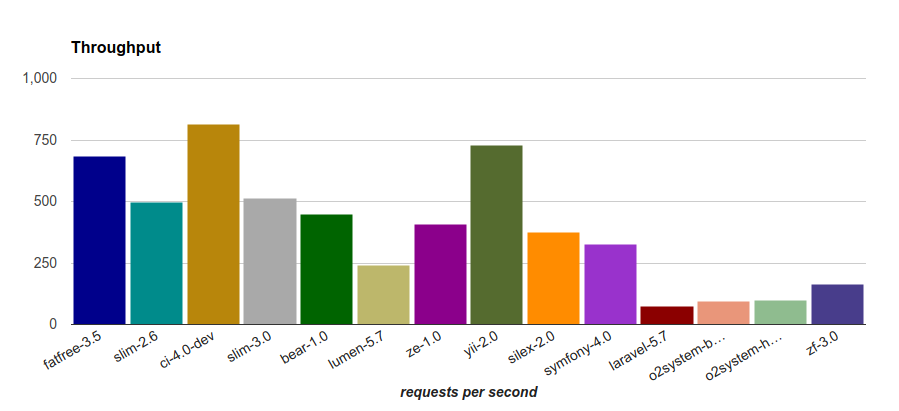

# PHP Framework Benchmark

This project attempts to measure minimum overhead (minimum bootstrap cost) of PHP frameworks in the real world.

So I think the minimum applications to benchmark should not include:

* cost of template engine (HTML output)
* cost of database manipulation
* cost of debugging information

Components like Template engine or ORM/Database libraries are out of scope in this project.

## Benchmarking Policy

This is `master` branch.

* Install a framework according to the official documentation.
* Use the default configuration.
  * Don't remove any components/configurations even if they are not used.
  * With minimum changes to run this benchmark.
* Set environment production/Turn off debug mode.
* Run optimization which you normally do in your production environment, like Composer's `--optimize-autoloader`.
* Use controller or action class if a framework has the functionality.

Some people may think using default configuration is not fair. But I think a framework's default configuration is an assertion of what it is. Default configuration is a good starting point to know a framework. And I can't optimize all the frameworks. Some frameworks are optimized, some are not, it is not fair. So I don't remove any components/configurations.

But if you are interested in benchmarking with optimization (removing components/configurations which are not used), See [optimize](https://github.com/o2system/benchmarks/tree/optimize) branch.

If you find something wrong with my code, please feel free to send Pull Requests. But please note optimizing only for "Hello World" is not acceptable. Building fastest "Hello World" application is not the goal in this project.

## Results

### Benchmarking Environment

* Fedora 28 64bit (Droptlet; Digital Ocean)
  * PHP 7.2 
    * Zend OPcache v7.2.13
  *  Apache/2.4.34 (Fedora)

### Hello World Benchmark

These are my benchmarks, not yours. **I encourage you to run on your (production equivalent) environments.**

(2017/02/14)



|framework          |requests per second|relative|peak memory|relative|
|-------------------|------------------:|-------:|----------:|-------:|
|fatfree-3.5        |             811.68|    10.9|       0.46|     inf|
|slim-2.6           |             603.73|     8.1|       0.52|     inf|
|ci-4.0-dev         |           1,030.29|    13.8|       0.00|     nan|
|slim-3.0           |             519.23|     7.0|       0.00|     nan|
|bear-1.0           |             425.33|     5.7|       0.65|     inf|
|lumen-5.7          |             228.51|     3.1|       0.00|     nan|
|ze-1.0             |             462.78|     6.2|       0.00|     nan|
|yii-2.0            |             847.80|    11.4|       0.00|     nan|
|silex-2.0          |             397.36|     5.3|       0.00|     nan|
|symfony-4.0        |             364.31|     4.9|       0.00|     nan|
|laravel-5.7        |              74.44|     1.0|       0.00|     nan|
|o2system-basic     |              98.34|     1.3|       0.00|     nan|
|o2system-hydro     |             102.01|     1.4|       0.00|     nan|
|zf-3.0             |             186.88|     2.5|       1.15|     inf|


## How to Benchmark

If you want to benchmark PHP extension frameworks like Phalcon, you need to install the extenstions.

Install source code as <http://localhost/php-framework-benchmark/>:

```sh
$ git clone https://github.com/o2system/benchmarks.git
$ cd php-framework-benchmark
$ bash setup.sh
```

Run benchmarks:

```sh
$ bash benchmark.sh
```

See <http://localhost/php-framework-benchmark/>.

If you want to benchmark some frameworks:

~~~
$ bash setup.sh fatfree-3.5/ slim-3.0/ lumen-5.1/ silex-1.3/
$ bash benchmark.sh fatfree-3.5/ slim-3.0/ lumen-5.1/ silex-1.3/
~~~

## Linux Kernel Configuration

I added below in `/etc/sysctl.conf`

~~~
# Added
net.netfilter.nf_conntrack_max = 100000
net.nf_conntrack_max = 100000
net.ipv4.tcp_max_tw_buckets = 180000
net.ipv4.tcp_tw_recycle = 1
net.ipv4.tcp_tw_reuse = 1
net.ipv4.tcp_fin_timeout = 10
~~~

and run `sudo sysctl -p`.

If you want to see current configuration, run `sudo sysctl -a`.

## Apache Virtual Host Configuration

~~~
<VirtualHost *:80>
  DocumentRoot /home/vagrant/public
</VirtualHost>
~~~

## References

* [o2sytem](o2system.id)
  * [o2system-basic](https://github.com/o2system/o2system)
  * [o2system-hydro](https://github.com/o2system/hydro)
* [Aura](http://auraphp.com/) ([@auraphp](https://twitter.com/auraphp))
* [BEAR.Sunday](https://bearsunday.github.io/) ([@BEARSunday](https://twitter.com/BEARSunday))
* [CakePHP](http://cakephp.org/) ([@cakephp](https://twitter.com/cakephp))
* [CodeIgniter](http://www.codeigniter.com/) ([@CodeIgniter](https://twitter.com/CodeIgniter))
* [Cygnite](http://www.cygniteframework.com/) ([@cygnitephp](https://twitter.com/cygnitephp))
* [FatFree](http://fatfreeframework.com/) ([@phpfatfree](https://twitter.com/phpfatfree))
* [FuelPHP](http://fuelphp.com/) ([@fuelphp](https://twitter.com/fuelphp))
* [Ice](http://www.iceframework.org/) ([@iceframework](https://twitter.com/iceframework)) [PHP extension]
  * See https://github.com/kenjis/php-framework-benchmark/pull/17#issuecomment-98244668
* [KumbiaPHP](https://github.com/KumbiaPHP/KumbiaPHP) ([@KumbiaPHP](https://twitter.com/KumbiaPHP))
  * [Install KumbiaPHP](https://github.com/KumbiaPHP/Documentation/blob/master/en/to-install.md#instalar-kumbiaphp)
* [Laravel](http://laravel.com/) ([@laravelphp](https://twitter.com/laravelphp))
* [Lumen](http://lumen.laravel.com/)
* [NoFussFramework](http://www.nofussframework.com/)
* [Phalcon](http://phalconphp.com/) ([@phalconphp](https://twitter.com/phalconphp)) [PHP extension]
  * [Installation](https://docs.phalconphp.com/en/latest/reference/install.html)
* [PHPixie](http://phpixie.com/) ([@phpixie](https://twitter.com/phpixie))
* [Radar](https://github.com/radarphp/Radar.Project)
* [Siler](https://github.com/leocavalcante/siler)
* [Silex](http://silex.sensiolabs.org/)
* [Slim](http://www.slimframework.com/) ([@slimphp](https://twitter.com/slimphp))
* [StaticPHP](https://github.com/gintsmurans/staticphp)
* [Symfony](http://symfony.com/) ([@symfony](https://twitter.com/symfony))
  * [How to Deploy a Symfony Application](http://symfony.com/doc/current/cookbook/deployment/tools.html)
* [Tipsy](http://tipsy.la)
* [Flow-Framework](https://flow.neos.io) ([@neoscms](https://twitter.com/neoscms))
* [Yii](http://www.yiiframework.com/) ([@yiiframework](https://twitter.com/yiiframework))
* [zend-expressive](https://github.com/zendframework/zend-expressive) ([@zfdevteam](https://twitter.com/zfdevteam))
* [Zend Framework](http://framework.zend.com/) ([@zfdevteam](https://twitter.com/zfdevteam))
