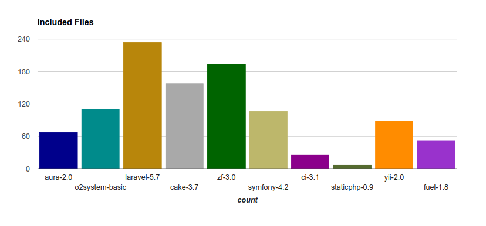

## Overview

The benchmark tool kit executes a simple “hello world”, it does this with the frameworks minimal settings, no database, no debugging and if possible, no template engine.

Read more about the testing on the [ benchmark tool kits](https://github.com/o2system/benchmarks)  page.

## Throughput

> In general terms, throughput is the maximum rate of production or the maximum rate at which something can be processed.

Applying this to our situation, this characteristic is measured in the request quantity that our framework can process within a second. Therefore, the higher this number is, the more productive our application is, as far as it is able to process queries of a large number of users correctly.

For illustrative purposes, we built graphic of throughput of PHP Framework

Several Framework have default setting bootstrap to load service. By Example, O2system, Laravel, Cake PHP and Aura php load modules, session, cache, but CI 3 and static php not load Modules, sessions.

## Peak Memory

This characteristic (in MB—megabytes) is responsible for the amount of peak memory utilized by the framework in fulfilling the task entrusted to it, therefore, the lower this number, the better it is for us and the server.

## Execution Time

Execution time is the time that the system takes to complete the task. Time is measured from the beginning of the task execution until the system gives the result.

Calculating this is quite simple. We have found out how many requests per second the framework can process, and how much memory it takes. Now let us consider how much time it will take to get a response from the server. Again, it is logical that the lower this value is, the better it is for us, and for the nervous system of the client of our application.

You can see the comparison table of request execution time on different frameworks when using the different versions of PHP. The time is in milliseconds (ms).

## Included Times

This characteristic is responsible for the amount of included files that are described in the file “entrance point” of the framework. It is clear that the system spends some time for searching and connecting. Therefore, the less the number of files, the faster the application will be launched for the first time. Usually, next time the framework works with the cache which speeds up the work.

