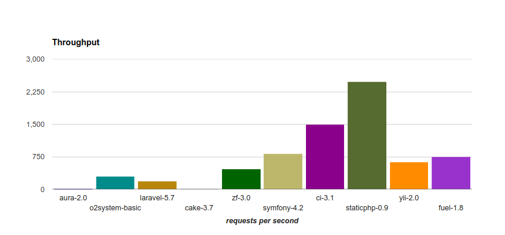
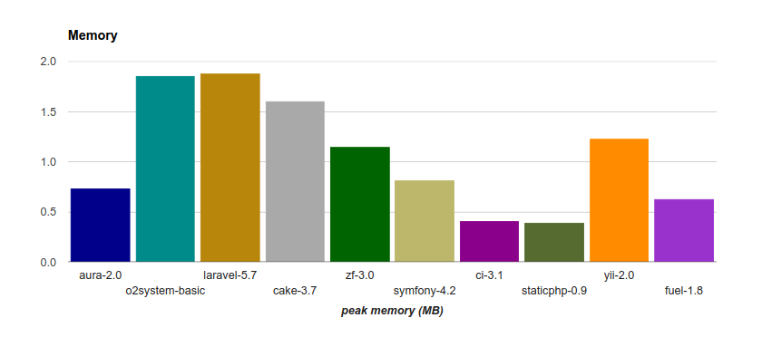
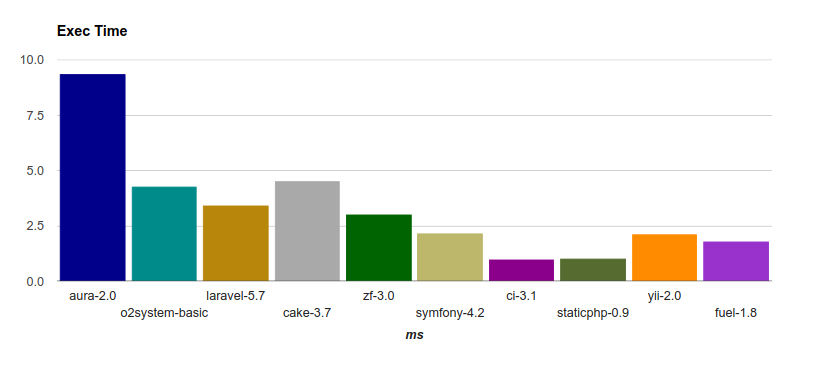
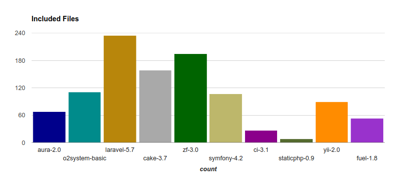

# Benchmark

## Environment

There is no special settings/optimizations to boost performance of some frameworks

The testing environment is as follows:

## Hardware

- Droplet Digital Ocean
- Main Memory: 1GB
- Hard Drive: 25 GB

## Software

- Operating System: Ubuntu Server 18.04
- Kernel: 4.15.0-43-generic 
- Web Server: Apache/2.4.29
- PHP: 7.2

